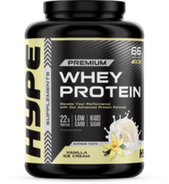

## Objetivo del proyecto
El objetivo de este proyecto es crear una **tienda web de suplementación deportiva** que permita a los usuarios comprar productos como *proteínas*, *creatina* y *vitaminas* de forma rápida y segura.

## Problema que resuelve
Muchas tiendas físicas no ofrecen una plataforma digital eficiente. Esta aplicación permite:

- Comprar suplementos online
- Consultar información nutricional
- Gestionar pedidos
- Pagar con tarjeta

### Ejemplo de producto
Un usuario puede buscar `proteína whey` y añadirla al carrito.

